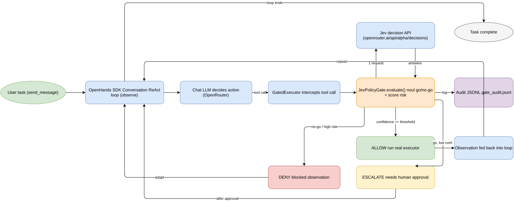

# jev-openhands-react-policy-gate

An OpenHands SDK ReAct agent whose every tool call is routed through an
**enforced** Jev policy gate. Jev (`typesafe/jev-1.13`) is a decision-only
model — it never chats — invoked once per tool call to answer a go/no-go
question plus a risk score; the chat/reasoning LLM (via OpenRouter) drives
the ReAct loop as usual.

## Architecture

```
Conversation (OpenHands SDK)
  └── Agent (chat LLM via OpenRouter)
        └── Tool("read_file"), Tool("delete_file")
              └── GatedExecutor(tool_name, real_executor, gate, audit)
                    ├── gate.evaluate(tool_name, action_args, state)   [1 batched Jev call]
                    │     -> GateDecision(action=ALLOW|DENY|ESCALATE, confidence, reason)
                    ├── ALLOW     -> delegates to the real ToolExecutor
                    └── DENY/ESCALATE -> returns a blocked Observation
                                          (agent sees it via to_llm_content
                                           and must adapt; nothing runs)
```

- `src/jev_policy_gate` (built separately, imported only) provides
  `JevPolicyGate`, `JevDecisionClient`, `DeterministicFakeJevClient`,
  `GateAction`.
- `examples/run_agent.py` inserts `src/` onto `sys.path` defensively so it
  works whether or not the package is pip-installed.
- Every gate decision, and every actually-executed tool call, is appended as
  a JSON line to `examples/sample_workspace/audit/gate_audit.jsonl`.
  Conversation events are also logged there and printed to stdout.
- The demo task seeds `examples/sample_workspace/notes.txt` and asks the
  agent to (a) read it — a clearly safe, low-risk action — and (b) delete
  it — a clearly risky, destructive action — so the gate visibly allows one
  and blocks the other.

## Workflow diagram



*Rendered from `docs/workflow.drawio` (headless drawio-export) — open the
.drawio in draw.io to edit, then re-export:*

```bash
docker run --rm -v "$PWD":/data -w /data rlespinasse/drawio-export \
  -f png -o . --output-mode relative docs
```

## Install

```bash
uv sync
```

`pyproject.toml` pins `openhands-sdk==1.49.6` and `openhands-tools==1.49.6`
(same version, per PyPI latest at time of writing).

## Run manually

### Keyless, network-free (verified — run it yourself)

```bash
uv run python examples/run_agent.py --dry-run
```

This is the only mode actually exercised end-to-end in this build. It skips
the SDK `Conversation`/`Agent` loop entirely and instead builds both
`ToolDefinition.create()` instances directly (each wraps its real executor
in a `GatedExecutor`), then feeds each one a representative action:

- `read_file(path="file4.txt")` — a clearly safe, low-risk read
- `delete_file(path="notes.txt")` — a clearly risky, destructive delete

Actual observed output (`uv run python examples/run_agent.py --dry-run`):

```
--- Exercising read_file (expected: ALLOW) ---
[gate] read_file: ALLOW -> {"event": "gate_decision", ... "gate_action": "ALLOW", ...}
[observation] [TextContent(... text='safe demo file: hello from file4\n')]

--- Exercising delete_file (expected: DENY/ESCALATE) ---
[gate] delete_file: DENY -> {"event": "gate_decision", ... "gate_action": "DENY", ...}
[observation] [TextContent(... "[POLICY GATE] Action on tool 'delete_file' was DENY ...")]

Audit log written to: .../examples/sample_workspace/audit/gate_audit.jsonl
```

Every decision is appended to `examples/sample_workspace/audit/gate_audit.jsonl`
as JSON lines, exactly as the live Conversation path would produce. No key,
no network call, no `openhands-sdk` LLM object is constructed for this mode.

### With a real OpenRouter key (via 1Password) — requires the key, not run here

```bash
op run --env-file=env.example.op -- uv run python examples/run_agent.py
```

Runs the actual OpenHands SDK `Conversation`/`Agent` ReAct loop. Uses the
real Jev decision API (`https://openrouter.ai/api/alpha/decisions`) and the
real chat LLM (`https://openrouter.ai/api/v1`, model from `LLM_MODEL` env
var, default `openrouter/anthropic/claude-sonnet-4.5`). Expected output is a
stream of `[event] ...` lines as the agent reads `notes.txt`/`file4.txt`
(allowed) and attempts to delete `notes.txt` (blocked, with a
`[POLICY GATE] ... DENY|ESCALATE ...` message fed back to the agent), ending
with `Audit log written to: .../gate_audit.jsonl`.

**Not verified live** — requires a real `OPENROUTER_API_KEY` and network
access, which this build task deliberately did not exercise.

```bash
op run --env-file=env.example.op -- uv run python examples/run_agent.py --fake-jev
```

Same live Conversation loop, but `--fake-jev` swaps in
`DeterministicFakeJevClient` for the *policy gate* only. The chat LLM call
to OpenRouter still requires `OPENROUTER_API_KEY` to actually converse — this
combination is also **not verified live** here.

## Verified locally

- `uv run python -m py_compile examples/run_agent.py` — **passes**.
- `uv run python examples/run_agent.py --dry-run` — **passes**, actually run
  in this environment; shows one `ALLOW` and one `DENY` decision plus
  matching audit JSONL lines (see output above).
- `PYTHONPATH=src .venv/bin/python -m unittest discover -s tests -v` — **26
  tests, all green**, unaffected by this change (`src/` was not modified).
- Full live `Conversation`/`Agent` loop (with or without `--fake-jev`) —
  **not executed**; requires a real `OPENROUTER_API_KEY` and network access,
  which this task deliberately did not exercise.
